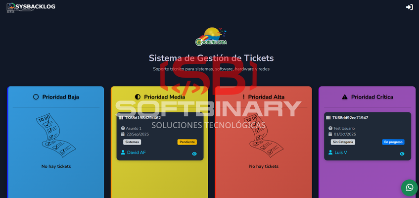
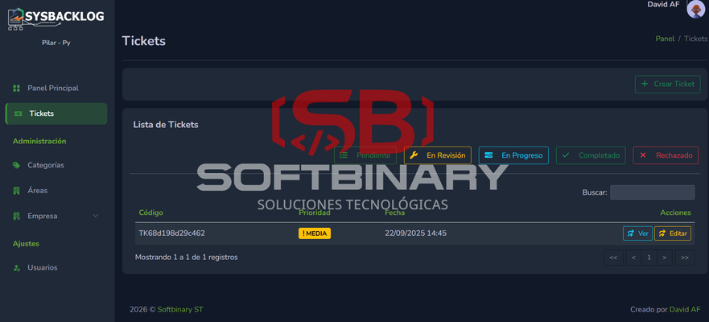
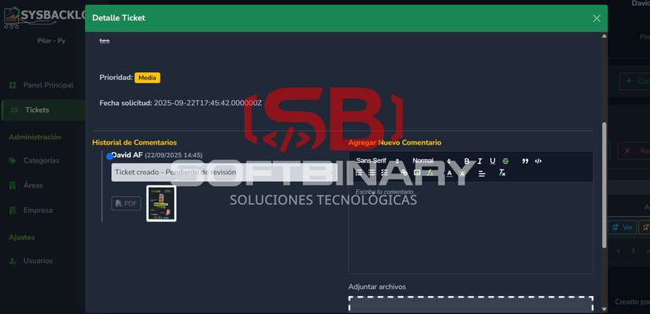
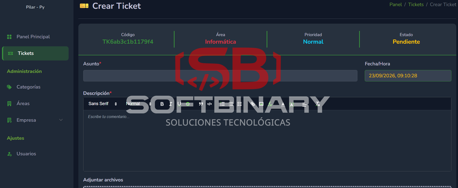

# Backlog System – Gestión de Tickets

## Descripción

Sistema para gestión de tareas, tickets y seguimiento de proyectos.

---

## Tecnologías

- Laravel
- MySQL
- Blade + Bootstrap

---

## Funcionalidades principales

- Gestión de tickets
- Priorización
- Seguimiento de estados
- Adjuntos y comentarios
- Roles y permisos
- Panel de backlog

---

## Capturas del sistema

| **Captura 1** | **Captura 2** |
| :---: | :---: |
|  |  |
| **Captura 3** | ****Captura 4** |
|  |  |

---

## Valor del sistema

Mejora la organización y seguimiento del trabajo.

---

## Nota

Proyecto privado.
