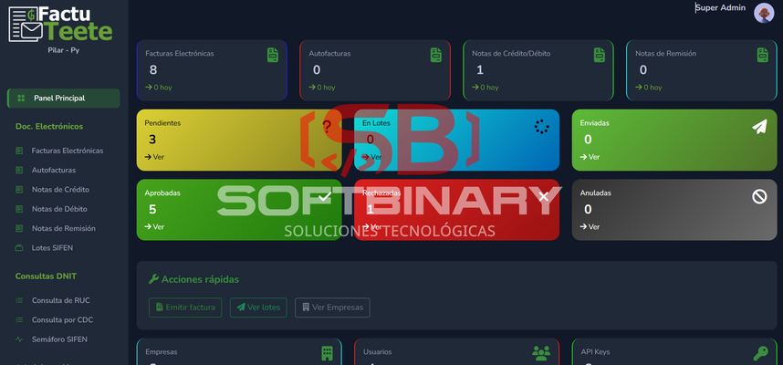
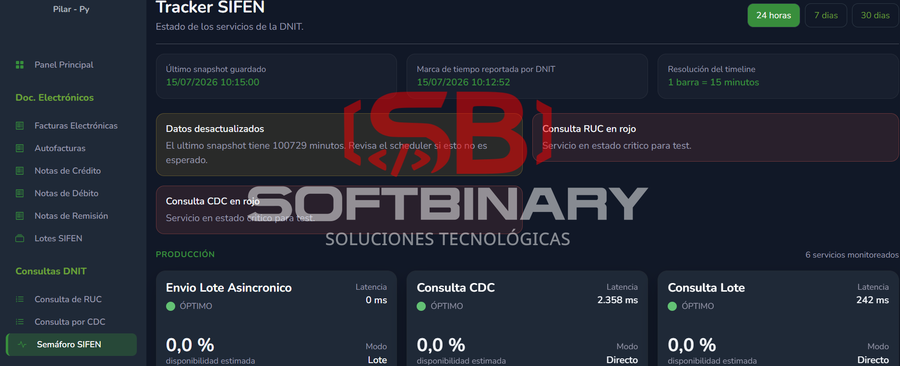
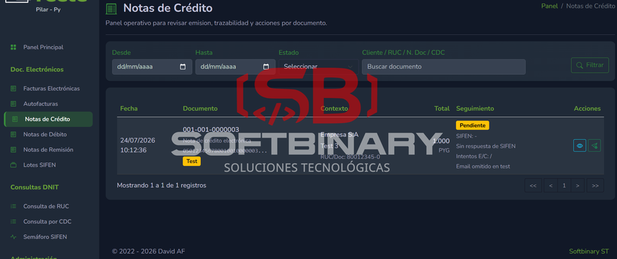
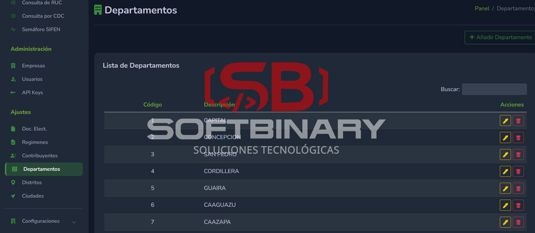

# FactuTeeté – Plataforma de Facturación Electrónica (SaaS)

## Descripción

Sistema SaaS multi-tenant para facturación electrónica en Paraguay, integrado con SIFEN y con API REST para integración externa.

---

## Tecnologías

- Laravel 10
- PHP 8.3
- PostgreSQL 13

---

## Funcionalidades principales

- Emisión de comprobantes electrónicos
- Envío a SIFEN y control de estados
- Dashboard en tiempo real
- Gestión de eventos (cancelaciones, inutilizaciones)
- Control de certificados digitales
- API REST
- Multiempresa

---

## Capturas del sistema

| **Captura 1** | **Captura 2** |
| :---: | :---: |
|  |  |
| **Captura 3** | ****Captura 4** |
|  |  |

---

## Valor del sistema

Permite operar con facturación electrónica cumpliendo normativas.

---

## Nota

Sistema en producción, código privado.
