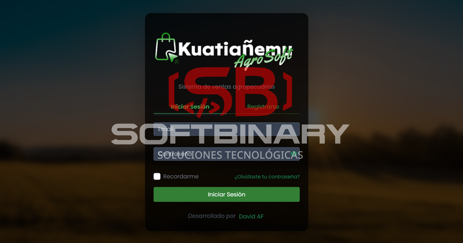
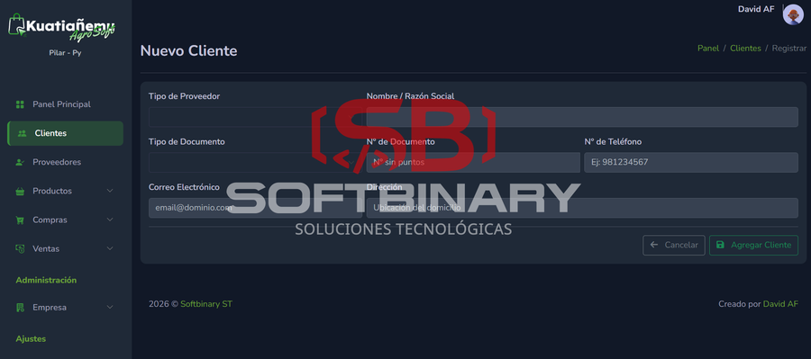
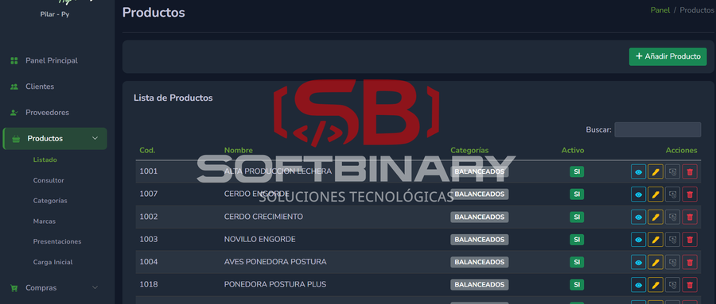
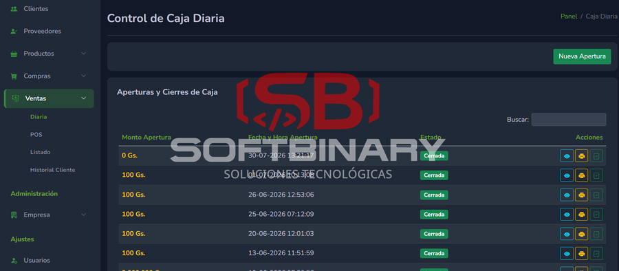

# Kuatiañemu AgroSoft – Sistema de Gestión Agropecuaria

<a href="../README.md" type="button" style="color: white; background: green; border: none; padding: 10px 20px; font-size: 16px; cursor: pointer; border-radius: 5px; text-decoration: none;">Volver al Inicio</a>

## Descripción

Sistema de gestión comercial adaptado al sector agropecuario, con manejo flexible de precios según tipo de cliente.

---

## Tecnologías

- Laravel 10
- PHP 8.3
- MySQL 8
- Blade + Bootstrap 5.3

---

## Funcionalidades principales

- Ventas con múltiples precios (contado, crédito, volumen)
- Manejo de clientes revendedores
- Compras y control de stock
- Transferencias entre sucursales
- Control de cajas
- Reportes comerciales
- Gestión de clientes y proveedores

---

## Capturas del sistema

| **Captura 1** | **Captura 2** |
| :---: | :---: |
|  |  |
| **Captura 3** | ****Captura 4** |
|  |  |

---

## Valor del sistema

Adaptado a la realidad comercial del sector agro.

---

## Nota

Proyecto privado desarrollado para clientes.
