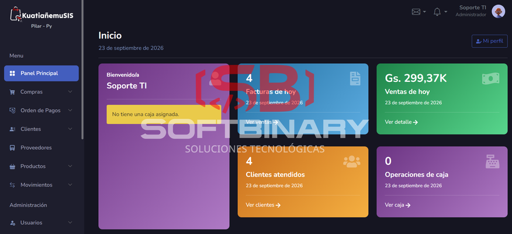
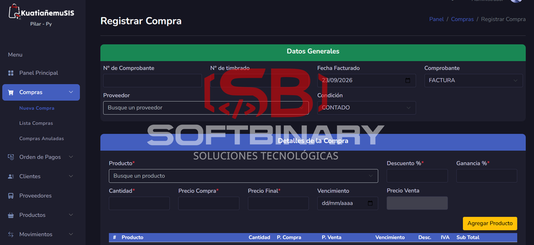
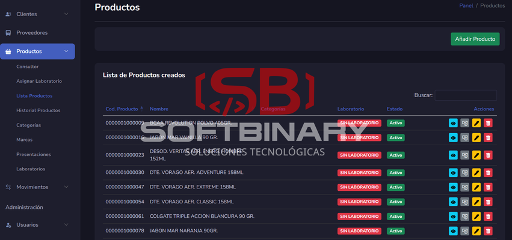
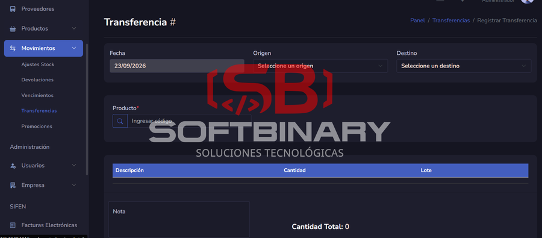

# Kuatiañemu FarmaSoft – Sistema de Gestión para Farmacias

## Descripción

Sistema integral de gestión para farmacias orientado a ventas, control de inventario y administración de clientes, incluyendo manejo de créditos y productos con vencimiento.

---

## Tecnologías

- Laravel 8
- PHP 7.4
- MySQL
- Blade + Bootstrap 5

---

## Funcionalidades principales

- Gestión de ventas con multipago
- Control de cajas y arqueos
- Inventario con lotes y vencimientos
- Compras y reposición de stock
- Transferencias entre sucursales
- Ajustes de inventario
- Control de clientes y proveedores
- Sistema de créditos y pagos de clientes
- Reportes administrativos

---

## Capturas del sistema

| **Captura 1** | **Captura 2** |
| :---: | :---: |
|  |  |
| **Captura 3** | ****Captura 4** |
|  |  |

---

## Valor del sistema

Permite gestionar productos sensibles como medicamentos con control de vencimiento.

---

## Nota

Proyecto privado desarrollado para uso comercial.
